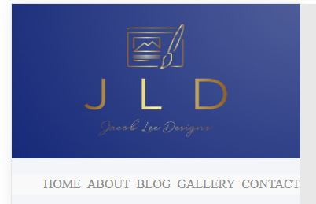
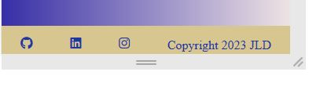
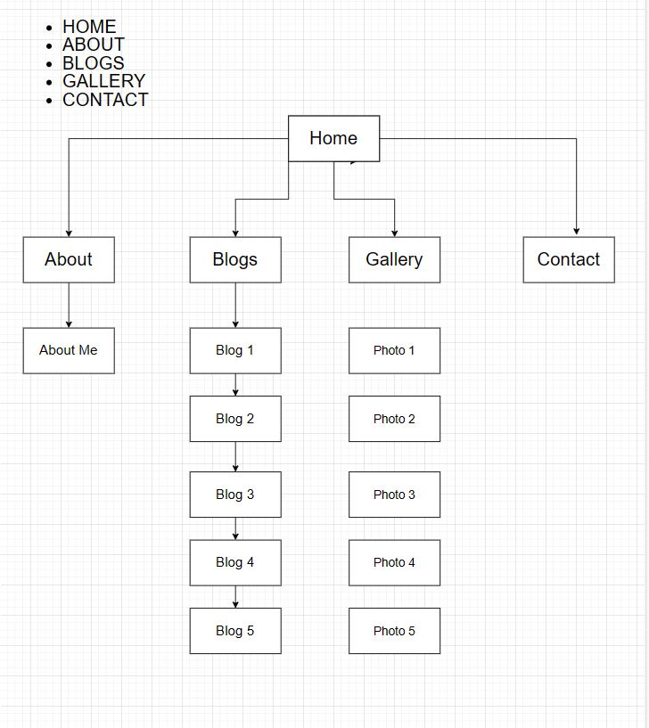

Link to git repository
https://github.com/JacobLee42/Assignment_T1A2

Link to Netlify
https://jacobleedesigns.netlify.app

Link to youtube
https://youtu.be/agQsllWQdqw

# Jacob Lee Portfolio

## Description

This Portfolio is a Website Assignment as part of Coder Academy's course curriculum. 

## Purpose

The purpose of this Porfolio assignment is to build a website to showcase to potential employers the skills that we have aquired whilst participating in the Diploma of IT course provided by Coder Academy. The website is to be of a professional nature, to showcase the individual's sense of style, interests as well as skillset. 

## Functionality/Features

### Home

The home page displays a header with the company logo as well as navbar. Colour should change on using navbar. Each website page has the company header at top and the footer at the bootom of the page. 

The navbar is a kind of floating style navbar and the codepen for the navbar is below as again, it was taken from Instagram:

The navbar displays the following pages; Home, About, Blog, Gallery and Contact.

Each of the icons contained within the footer link to their corresponding webpages.

In the body section I have kept it basic with a landing page that says 'welcome'.

I will add the corresponding codepen photos underneath that I used to create this effect as I grabbed this off Instagram:

I think it is a nice and inviting home page.

### About

The about page I kept rather basic as you can see from the image below. 

I have included a photo of myself as well as a little bit about me. As you can see, logo and navbar on top of the page and footer should be below when we scroll down. 

At the bottom of the About page is a resume button. Click on it and it links to my resume. The button has a simple hover effect on the button which should make it shine:

### Blog

The blog page has 5 articles that are centered around the concept of me studying this course. Placeholder text has been used in each article.

The link to the codepen for the main concept can be found here:

https://codepen.io/akramnarejo/pen/jOmegxK

Three (3) of the articles have links to external websites that are similar to the blog article. The article also has 'continue reading' tags that change colour, but do not link to anything, due to it being placeholder articles. The widgets at the bottom are of the articles and have the option to link if the articles were real, published articles and not placeholders. (I took the widgets out and the corresponding CSS code but it all went pear-shaped real quick so I put the code back in so it would work.)

### Gallery

The gallery is also a simple plain gallery as set out below:

It has the main selected image up top, with the selection of images to choose from below it. Once the image is selected from below, a blue box-border should appear around the selected photo. The images were taken from some of the work done as challenges.
And a funny one of me while in Japan a few years ago - cause why not!

The link to the codepen used to help style and create is below:

https://codepen.io/siiron/pen/QWwLoMy

### Contact

The contact form is straighforward as below:

The form has everything we need for the perspective client or potential employer to get in contact with us.

The link for the codepen used to help create/style is below:

https://codepen.io/leenalavanya/pen/mPWdPZ

The main issue I had with this, as well as most codepens I attempted to use or draw inspiration from, was that it is mainly written and appears full screen. As someone with rather limited experience, it posed a challenge somewhat with resizing to fit in the desired space I wanted it to occupy.  I somehow managed to resize things and make them fit as required and it seemed to work out rather ok for the most part.

## Sitemap

The sitemap is a basic HTML sitemap which lists all the important information about the pages on a website. As you see from the image below, the sitemap lists the main website pages in hierarchical order (level of importance). So we can see that the main pages of my website are at the top of the map (Home, About etc,). We can see that the blog page has five (5) articles that wil be added as the content for the Blog page. Image is below:

## Screenshots

Most of the screenshots are above, however I will add the view in each mobile, tablet and desktop below:

## Target Audience

The target audience for this portfolio assignment is for potential employers or clients that may wish to employ our services at the completion of the Diploma of IT course provided by Coder Academy. It also serves a dual purpose of demonstrating the skills and knowledge gained so far in the course not only to potential employers but to our teachers, demonstrators, educators it shows where we are individually in our skills and knowledge, but ultimately what area we need to focus on to shore up any gaps in our skills and knowledge.

## Tech Stack

I used Looka to create my logo - Jacob Lee Designs. I used this logo as my header. I used Visual Studio Code (VS Code) a source-code editor used to compile all the code. I used Hypertext Markup Language (HTML), Cascading Style Sheets (CSS) and Sassy Cascading Style Sheets (SCSS) to create and style the content displayed on the web pages. I used Google Chrome search engine to help me troubleshoot problems, find inspiration etc. I used Figma for the wireframing and Drawio for the sitemap. I used Github - an internet hosting service for software development and version control using Git. I used Codepen and Instagram for coding advice, inspiration, ideas, etc. I used Netlify (when it works) to send my project website live. I used W3schools - an online web tutorial website and Stack Overflow - a large community of people experienced in IT - who help with any issues you may be facing while coding, etc. I also used the Coder Academy Discord link to send messages if I had any questions or challanges that arose while creating the website. I also used the Coder Academy class recordings if their was something I needed help with. I used Snippet - a image capture tool I used to capture screenshots. 

# The End 